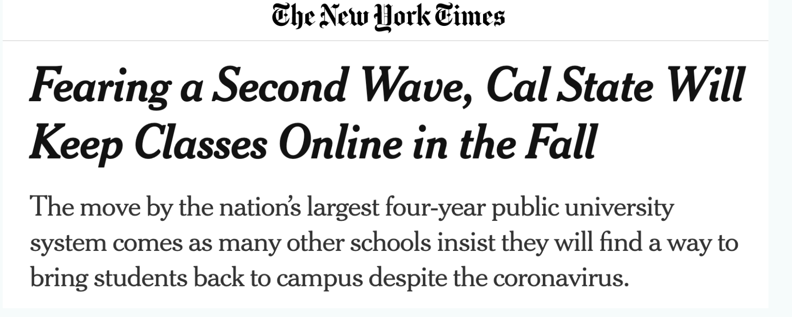
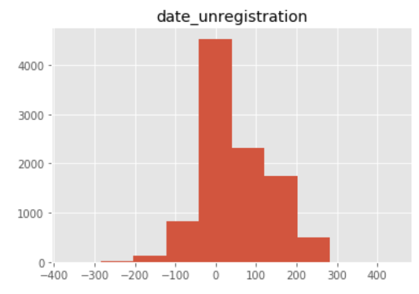
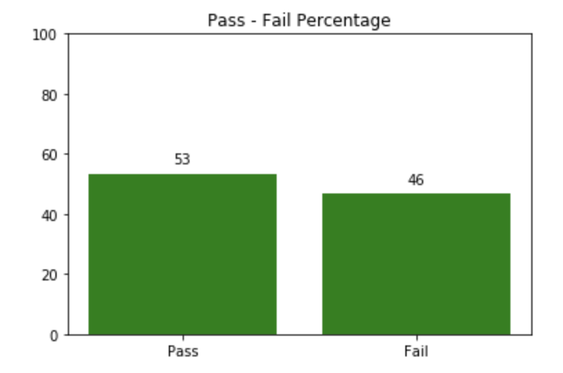
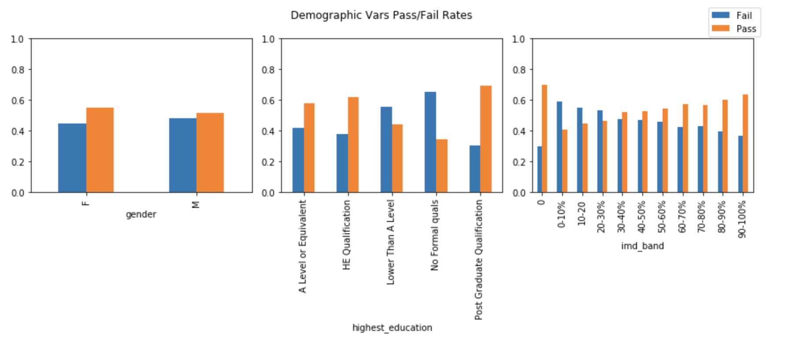
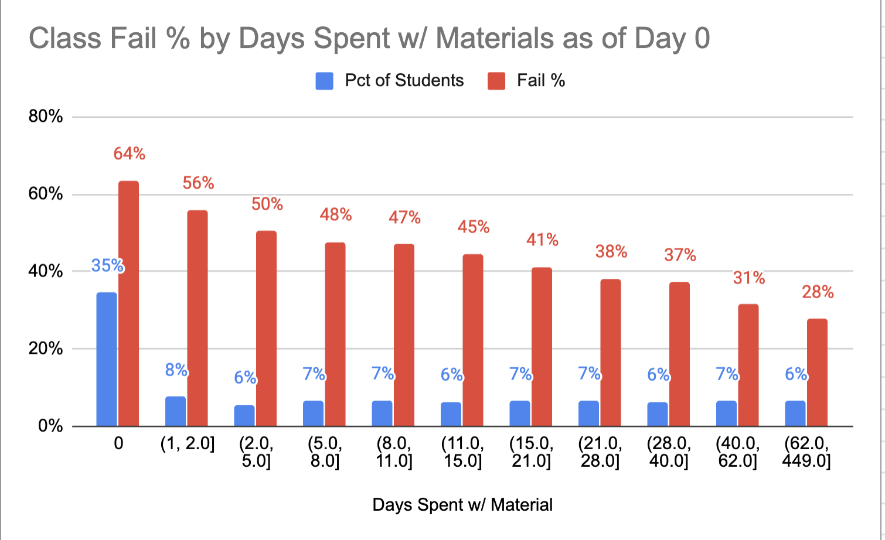
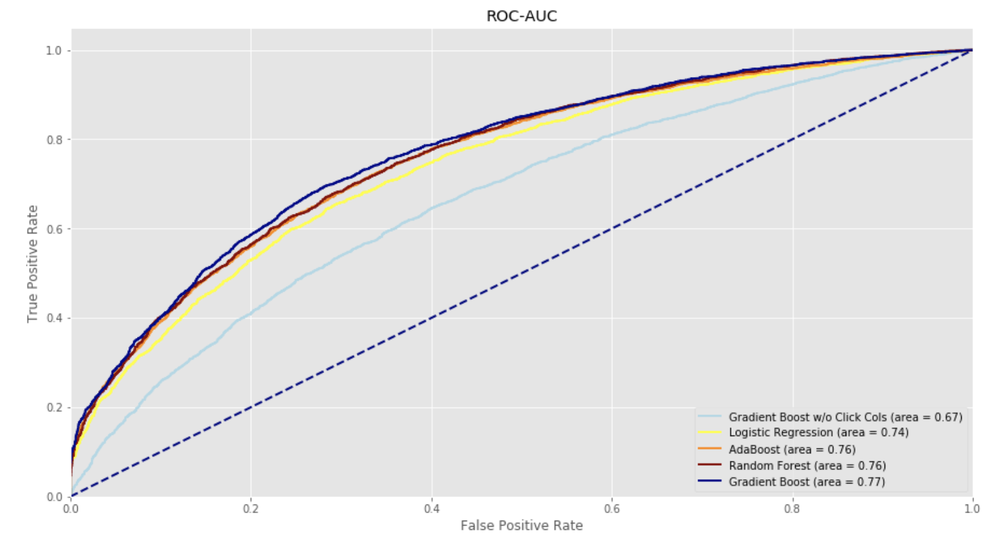
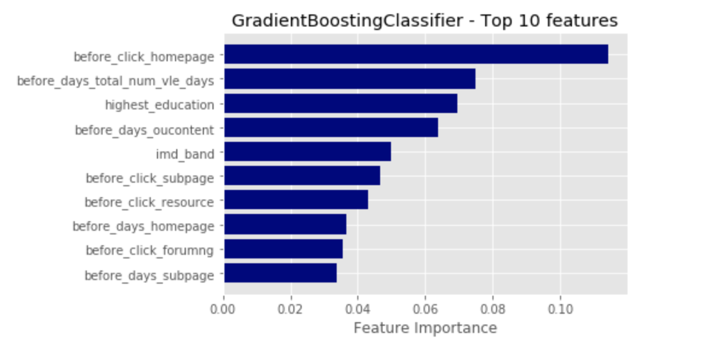

# New possibilities with the movement toward online learning

## Predicting Virtual Learning Outcomes

Due to the rapid shift towards virtual learning brought on by COVID-19, I am interested in looking into the new possibilities given the additional data virtual learning offers to the education space. I take a dataset from the U.K.'s largest undergraduate education provider, The Open University, to create a prediction model which seeks to identify which students have the highest propensity to fail as of Day 1 of any course. I primarily investigate hypotheses related to if specific student interactions with the online platform are strong predictors for passing or failing a class.

*by JDyBuncio*
*5/15/2020*

## Accessibility to the Code
To gain access to the cleaned dataframe and the helper functions I created to evaluate my models, one can clone this repository and run the following:
```
git clone https://github.com/jdybuncio/predicting-virtual-learning-outcomes.git
cd predicting-virtual-learning-outcomes/src
python data_processing_script.py
```
This will create the dataframe I used and can be accessed in:  ```data/dataset_for_modeling_day_zero.csv``` 
Helper functions can be imported from: ```src/modeling_script.py```
The master branch also has a modeling_notebook repository which contains a python notebook which uses the cleaned dataframe to create the prediction models I evaluate.


## Table of Contents
- [Introduction](#introduction)
  - [Background](#background)
  - [The Data](#the-data)
  - [Question and Hypothesis](#question-and-hypothesis)
  - [Methodology](#methodology)
- [Exploratory Data Analysis](#exploratory-data-analysis-highlights)
- [Model Selection](#model-selection)
  - [Test Metric](#test-metric)
  - [Model Evaluation](#model-evaluation)
  - [Hyperparameter Tuning](#feature-importance)
  - [Results and Interpretation](#results-and-interpretation)
- [Conclusion](#conclusion)


# Introduction

## Background

<p align="center">
  
</p>

As the headline shows above, several universities across the world are grappling with the impacts of coronavirus to their normal, in-person, curricula. Several universities, such as all those belonging to the Cal-State umbrella, have already announced that all courses offerred in the Fall of 2020 will be remote [source](https://www.nytimes.com/2020/05/12/us/cal-state-online-classes.html). This presents several challenges and a large change. But, it also is an opportunity to learn more about student behavior since on-line courses allow for increased data collection. For example, in order to understand how a student is performing, one normally would rely on a students' homework and test scores and qualitative metrics such as class participation. What is not used though are all the hours students spend outside of the classroom which could serve as strong predictors of success or failure. 

A movement to on-line courses would add to one's ability to gauge how a student is performing. Specificially, the use of cookies would allow a university to further track students' interactions with material which occurr outside of the normal class hours. While this would represent a "new" normal for students who have not engaged in on-line courses in the past, it also opens up increased possibilities to identify struggling students earlier and to intervene.

In that context, the following work seeks to use data we have on students from demographic variables, class information, and students' interactions with online materials to create and evaluate prediction models to try to identify who is at-risk of failing a class in the hopes of intervening earlier.


## The Data

The Open University is the largest undergraduate provider in the U.K.. They have made available a dataset [link](https://analyse.kmi.open.ac.uk/open_dataset) which covers 7 modules which were presented 2-4 times across 4 terms: Feb 2013, Oct 2013, Feb 2014, and Oct 2014. The dataset contains 7 tables which contain information on the: Course, Assessments, Students, Registration, Scores, VLE material, and VLE Logs. **VLE stands for virtual learning environment**, and the data offerred consists of what types of on-line resources are made available in each presentation of the course and, most interestingly, students' daily behvaior with each source down to the click level. For example, this dataset has if a student clicked on the homepage 5 times on the 8th day of a module presentation. The dataset covers 32k+ student outcomes across the 7 modules.

## Question and Hypothesis

Can one predict who will Fail the course on the first day of a class?

I hypothesize that using a combination of student demographics, course information, and students' interaction with materials before a class even begins will allow me to predict a student's probability of failing on the first day of a given module-presentation. I focus on trying to do this as of Day 1 of a class starting in order to maximize potential application and to minimize potential leakage which will be discussed in the following sections.

Potential Application
* Educator perspective 
  * Being able to identify who is at-risk on the first day of class would allow an educator to create intervention strategies early and time to implement them.
* Administrator perspective
  * Adminstrators may be concerned with maximizing retention in hopes of maximizing tuition. They also could be interested in maximizing graduation rates for instituional ranking purposes.


## Methodology

1. Load in and perform EDA on each of the 7 data tables provided. This work can be followed by switching to the exploratory_branch of this repository which has a python notebook which contains a summary of my findings.
2. Merge the dataframes together and perform feature engineering on the VLE level data. Perfom additional EDA.
3. Create a baseline model using univariate analysis. For example, using a student's highest education level, to what degree of accuracy could I predict if a student would fail a given module-presentation.
4. Train and test: Logistic Regression, Random Forest, Ada Boost, and Gradient Boosting models via Cross Validation. Evaluate models based off of the highest AUC scores to guide in model tuning and feature selection. This work can be followed by looking at the python notebook contained in the modeling_notebook repository on the master branch.

[Back to Top](#Table-of-Contents)

# Exploratory Data Analysis Highlights

* **Leakage Considered**

I can only consider data I have as of Day 1 of a module-presentation starting to prevent any potential leakage. Some students though already withdraw from a class before Day 1 and are marked as failing the course. I removed these students - 3k students, 9% of the dataset -  and that is reflected in all subsequent analysis.

<p align="center">
  

* **Class Balance**

53% of the students Passed and 47% of the students Failed  the module-presentations I observed. This represents a fairly balanced class which means I do not need to employ any over/under sampling techniques.

<p align="center">
  

* **Relationships to Pass/Fail Rates across some demographic variables**

Females have slightly higher pass rates than Males in the dataset I have. Those with higher levels of education and who took the class from higher income areas (using the IMD band measure) have higher pass rates as well.

<p align="center">
  
</p>

* **Relationships to Pass/Fail Rates to VLE interactions**

I created a feature which marks the number of days before Day 1 of a class that a student interacts with the VLE materials. For example, if a student clicked on any one of the available materials of a module-presentation across 40 days before a class, I would mark them as having 40 days interacting with the VLE materials. This graph served as the basis of my central hypothesis since it shows the largest disparity in fail rates that I saw across any single variable. Students who spent more days with the material **before the class even began** have much lower fail rates than those who did not interact with the materials at all.

<p align="center">
  
</p>


[Back to Top](#Table-of-Contents)

# Model Selection

## Test Metric

The metric I chose to evaluate my models was to optimize the **AUC** (area-under-the-curve) since I want to:
* Maximize the TPR: Predict maximum % students who Fail.
* Minimize the FPR: Minimize the % of students predicted to fail who Pass since doing so minimizes potential intervention costs.

## Model Evaluation
I used Cross Validation to evaluate the AUC of each of my models in order to direct my hyperparameter tuning and feature selection. 

I also used SKLearn's GridSearch to find the best values for the hyperparameters in my Random Forest and Boosting models.

## Chosen Model
My Gradient Boost Model which included all the VLE interaction features I created had the highest AUC (0.77 - represented by the navy line in the image below). I got the same AUC when using my model to predict my validation set and also the testing set. The parameters of this model were:
n_estimators = 400, learning_rate = 0.2
                                      ,min_samples_split = 5
                                      ,min_samples_leaf = 100
                                      ,max_depth = 3
                                      ,max_features = 'sqrt'
                                      ,and subsample = 1.


<p align="center">
  
</p>

## Feature Importance
Below shows the Top 10 Features measured using SKLearn's feature importance from my chosen Gradient Boost model.

<p align="center">
  
</p>


## Results and Interpretation
From my best Gradient Boost model, at a **threshold of 0.39**, I have:
* TPR (true-positive-rate), i.e. the percentage of students who fail that I accurately predict, to be **0.80**. 
* FPR (false-positive-rate), i.e. the percentage of students who pass that I predict to fail, to be **0.42**

So my model can predict 80% of the students who will Fail on the first day of class, but it will also  predict 42% of those who will pass, would Fail. The most important features in my model relate to the number of clicks a student has on the homepage before Day 1 of the class and the total number of days interacting with any of the VLE material before the first day of class.

# Conclusion
With a movement on-line, we have access to new student data which can help students, teachers and administrators better achieve success, however defined. This repository shows that tracked student behavior with class materials before a class officially begins is a strong predictor for student success and failure, relative to student demogrographics and class information for the given dataset observed. This is not surprising since interaction with materials before Day 1 could be a proxy which captures student preparedness and how serious one is taking the course, especially in an online environment where 30%+ of students eventually withdraw. Student interaction variables give us a way to capture this, unlike in in-person settings.

I speculate that as schools move increasingly online, more work will be done to mine the new data collected, such as that discussed in this repository, and will be used for new applications we otherwise were not privy to in in-person settings.

[Back to Top](#Table-of-Contents)


